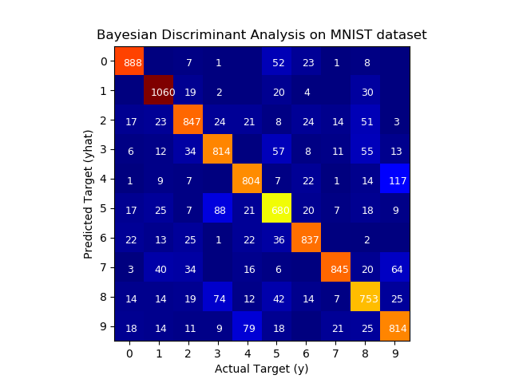
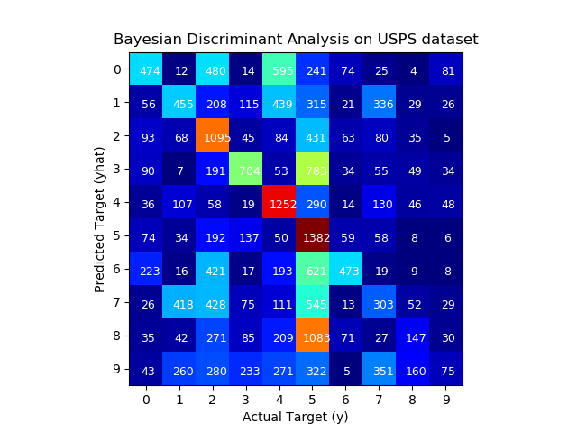
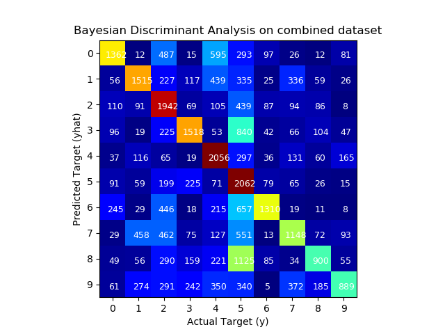

# Image Classification with MNIST Dataset

In this project we implement different machine learning models to classify images in the MNIST dataset.

We train our models using the MNIST training dataset and test the performance on the MNIST test dataset and the USPS dataset.

We train the following classifiers:
1. Bayesian Discriminant Function
2. Logistic Regression
3. SVM (Support Vector Machine) Package
4. Random Forest Package
5. Multilayer perceptron Neural Network

### Observations

1. Bayesian Discriminant Function, achieving an accuracy of 84%

     

2. Logistic Regression, achieving an accuracy of 86%

3. SVM (Support Vector Machine) Package, achieving an accuracy of 97%

4. Random Forest Package, achieving an accuracy of 97%

5. Multilayer perceptron Neural Network, achieving an accuracy of 98%

